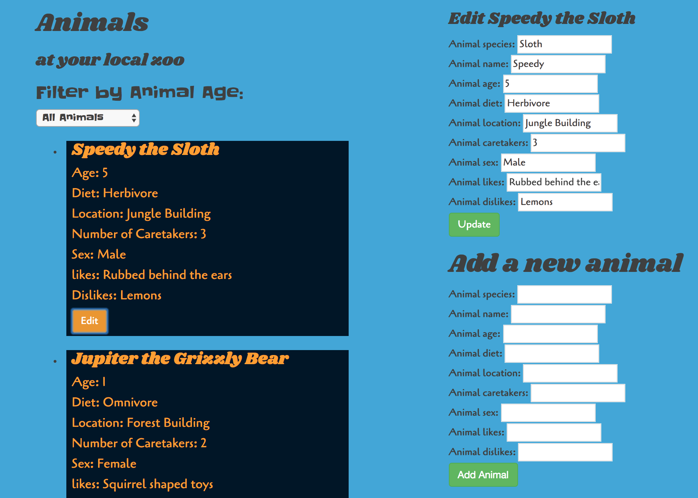

# _Local Zoo_

#### _This application will log animals by species, name, age, diet, location, caretakers, sex, likes, and dislikes_

#### By _**Nate McGregor**_

## Setup/Installation Requirements

* _Clone git repository_
```
git clone https://github.com/hal2814/local-zoo
```
* _Make sure node is installed, if not you can install it here:_

https://www.npmjs.com/
======================

* _In the console_
```
cd local-zoo
```
* _Then run_
```
npm install && bower install && gulp build && gulp serve
```




## Technologies Used
_Angular 2, HTML, CSS, JavaScript, jQuery, built and served with Bower and Gulp. Reliant on the betterdoctor.com API and the Google Maps geocoder API._

## Future Features

Copyright (c) 2017 **_Nate McGregor_**
